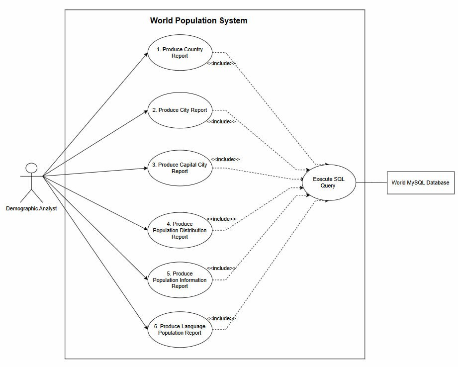

# World Population Reporting System - Description of Use Case Diagram

  

  <strong>Figure 1: World Population Reporting System Use Case Diagram</strong>

## Actor

**Demographic Analyst**

The Demographic Analyst uses the Population Reporting System to produce population reports and retrieve population information.

---

## 1: Produce Country Reports

This use case group contains requirements 1-6.

### 1.1: Report All Countries in the World by Population

**Requirement:** 1

**User Story:**
As a Demographic Analyst, I want to produce a report of all countries in the world organized by population from largest to smallest so that I can compare population sizes across countries worldwide.

**Description:**
The system produces a report containing all countries in the world, ordered by population from largest to smallest.

**Actor:**
Demographic Analyst

**Preconditions:**

* Country and population data is available.

**Main Flow:**

1. The Demographic Analyst requests the world country population report.
2. The system retrieves population data for all countries.
3. The system sorts the countries by population in descending order.
4. The system displays the report.

**Postcondition:**

* A ranked list of all countries by population is displayed.

---

### 1.2: Report All Countries in a Continent by Population

**Requirement:** 2

**User Story:**
As a Demographic Analyst, I want to produce a report of all countries in each continent organized by population from largest to smallest so that I can analyze population distribution across continents.

**Description:**
The system produces reports containing all countries in each continent, ordered by population from largest to smallest.

**Actor:**
Demographic Analyst

**Preconditions:**

* Country, continent and population data is available.

**Main Flow:**

1. The Demographic Analyst requests the continent country population report.
2. The system retrieves all countries and their continent information.
3. The system groups the countries by continent.
4. The system sorts the countries in each continent by population in descending order.
5. The system displays the reports.

**Postcondition:**

* Ranked lists of countries by population for each continent are displayed.

---

### 1.3: Report All Countries in a Region by Population

**Requirement:** 3

**User Story:**
As a Demographic Analyst, I want to produce a report of all countries in each region organized by population from largest to smallest so that I can compare population sizes across regions.

**Description:**
The system produces reports containing all countries in each region, ordered by population from largest to smallest.

**Actor:**
Demographic Analyst

**Preconditions:**

* Country, region and population data is available.

**Main Flow:**

1. The Demographic Analyst requests the regional country population report.
2. The system retrieves all countries and their region information.
3. The system groups the countries by region.
4. The system sorts the countries in each region by population in descending order.
5. The system displays the reports.

**Postcondition:**

* Ranked lists of countries by population for each region are displayed.

---

### 1.4: Report Top N Populated Countries in the World

**Requirement:** 4

**User Story:**
As a Demographic Analyst, I want to produce a report of the top N populated countries in the world so that I can identify countries with the largest populations worldwide.

**Description:**
The system produces a report containing the N most populated countries in the world.

**Actor:**
Demographic Analyst

**Preconditions:**

* Country and population data is available.
* The value of N is provided.

**Main Flow:**

1. The Demographic Analyst specifies N.
2. The system retrieves country population data.
3. The system sorts countries by population in descending order.
4. The system selects the top N countries.
5. The system displays the report.

**Postcondition:**

* The top N populated countries are displayed.

---

### 1.5: Report Top N Populated Countries in a Continent

**Requirement:** 5

**User Story:**
As a Demographic Analyst, I want to produce a report of the top N populated countries in each continent so that I can identify the most populated countries within each continent.

**Description:**
The system produces reports containing the N most populated countries within each continent.

**Actor:**
Demographic Analyst

**Preconditions:**

* Country, continent and population data is available.
* The value of N is provided.

**Main Flow:**

1. The Demographic Analyst specifies N.
2. The system retrieves the countries and their continent information.
3. The system groups the countries by continent.
4. The system sorts the countries in each continent by population in descending order.
5. The system selects the top N countries from each continent.
6. The system displays the reports.

**Postcondition:**

* The top N populated countries in each continent are displayed.

---

### 1.6: Report Top N Populated Countries in a Region

**Requirement:** 6

**User Story:**
As a Demographic Analyst, I want to produce a report of the top N populated countries in each region so that I can identify the most populated countries within each region.

**Description:**
The system produces reports containing the N most populated countries within each region.

**Actor:**
Demographic Analyst

**Preconditions:**

* Country, region and population data is available.
* The value of N is provided.

**Main Flow:**

1. The Demographic Analyst specifies N.
2. The system retrieves the countries and their region information.
3. The system groups the countries by region.
4. The system sorts the countries in each region by population in descending order.
5. The system selects the top N countries from each region.
6. The system displays the reports.

**Postcondition:**

* The top N populated countries in each region are displayed.

---

## 2: Produce City Reports

This use case group contains requirements 7-16.

### 2.1: Report All Cities in the World by Population

**Requirement:** 7

**User Story:**
As a Demographic Analyst, I want to produce a report of all cities in the world organized by population from largest to smallest so that I can compare city populations worldwide.

**Description:**
The system produces a report containing all cities in the world, ordered by population from largest to smallest.

**Actor:**
Demographic Analyst

**Preconditions:**

* City and population data is available.

**Main Flow:**

1. The Demographic Analyst requests the world city population report.
2. The system retrieves city population data.
3. The system sorts cities by population in descending order.
4. The system displays the report.

**Postcondition:**

* A ranked list of all cities worldwide is displayed.

---

### 2.2: Report All Cities in a Continent by Population

**Requirement:** 8

**User Story:**
As a Demographic Analyst, I want to produce a report of all cities in each continent organized by population from largest to smallest so that I can analyze city populations across continents.

**Description:**
The system produces reports containing all cities in each continent, ordered by population from largest to smallest.

**Actor:**
Demographic Analyst

**Preconditions:**

* City, country, continent and population data is available.

**Main Flow:**

1. The Demographic Analyst requests the continent city population report.
2. The system retrieves city and country information.
3. The system identifies the continent for each city.
4. The system groups the cities by continent.
5. The system sorts the cities in each continent by population in descending order.
6. The system displays the reports.

**Postcondition:**

* Ranked lists of cities by population for each continent are displayed.

---

### 2.3: Report All Cities in a Region by Population

**Requirement:** 9

**User Story:**
As a Demographic Analyst, I want to produce a report of all cities in each region organized by population from largest to smallest so that I can compare city populations across regions.

**Description:**
The system produces reports containing all cities in each region, ordered by population from largest to smallest.

**Actor:**
Demographic Analyst

**Preconditions:**

* City, country, region and population data is available.

**Main Flow:**

1. The Demographic Analyst requests the regional city population report.
2. The system retrieves city and country information.
3. The system identifies the region for each city.
4. The system groups the cities by region.
5. The system sorts the cities in each region by population in descending order.
6. The system displays the reports.

**Postcondition:**

* Ranked lists of cities by population for each region are displayed.

---

### 2.4: Report All Cities in a Country by Population

**Requirement:** 10

**User Story:**
As a Demographic Analyst, I want to produce a report of all cities in each country organized by population from largest to smallest so that I can analyze population distribution across cities within countries.

**Description:**
The system produces reports containing all cities in each country, ordered by population from largest to smallest.

**Actor:**
Demographic Analyst

**Preconditions:**

* City, country and population data is available.

**Main Flow:**

1. The Demographic Analyst requests the country city population report.
2. The system retrieves city and country information.
3. The system groups the cities by country.
4. The system sorts the cities in each country by population in descending order.
5. The system displays the reports.

**Postcondition:**

* Ranked lists of cities by population for each country are displayed.

---

### 2.5: Report All Cities in a District by Population

**Requirement:** 11

**User Story:**
As a Demographic Analyst, I want to produce a report of all cities in each district organized by population from largest to smallest so that I can compare population sizes across districts.

**Description:**
The system produces reports containing all cities in each district, ordered by population from largest to smallest.

**Actor:**
Demographic Analyst

**Preconditions:**

* City, district and population data is available.

**Main Flow:**

1. The Demographic Analyst requests the district city population report.
2. The system retrieves city and district information.
3. The system groups the cities by district.
4. The system sorts the cities in each district by population in descending order.
5. The system displays the reports.

**Postcondition:**

* Ranked lists of cities by population for each district are displayed.

---

### 2.6: Report Top N Populated Cities in the World

**Requirement:** 12

**User Story:**
As a Demographic Analyst, I want to produce a report of the top N populated cities in the world so that I can identify cities with the largest populations worldwide.

**Description:**
The system produces a report containing the N most populated cities in the world.

**Actor:**
Demographic Analyst

**Preconditions:**

* City and population data is available.
* The value of N is provided.

**Main Flow:**

1. The Demographic Analyst specifies N.
2. The system retrieves city population data.
3. The system sorts cities by population in descending order.
4. The system selects the top N cities.
5. The system displays the report.

**Postcondition:**

* The top N populated cities worldwide are displayed.

---

### 2.7: Report Top N Populated Cities in a Continent

**Requirement:** 13

**User Story:**
As a Demographic Analyst, I want to produce a report of the top N populated cities in each continent so that I can identify the most populated cities within each continent.

**Description:**
The system produces reports containing the N most populated cities within each continent.

**Actor:**
Demographic Analyst

**Preconditions:**

* City, country, continent and population data is available.
* The value of N is provided.

**Main Flow:**

1. The Demographic Analyst specifies N.
2. The system retrieves city and country information.
3. The system identifies the continent for each city.
4. The system groups the cities by continent.
5. The system sorts the cities in each continent by population in descending order.
6. The system selects the top N cities from each continent.
7. The system displays the reports.

**Postcondition:**

* The top N populated cities in each continent are displayed.

---

### 2.8: Report Top N Populated Cities in a Region

**Requirement:** 14

**User Story:**
As a Demographic Analyst, I want to produce a report of the top N populated cities in each region so that I can identify the most populated cities within each region.

**Description:**
The system produces reports containing the N most populated cities within each region.

**Actor:**
Demographic Analyst

**Preconditions:**

* City, country, region and population data is available.
* The value of N is provided.

**Main Flow:**

1. The Demographic Analyst specifies N.
2. The system retrieves city and country information.
3. The system identifies the region for each city.
4. The system groups the cities by region.
5. The system sorts the cities in each region by population in descending order.
6. The system selects the top N cities from each region.
7. The system displays the reports.

**Postcondition:**

* The top N populated cities in each region are displayed.

---

### 2.9: Report Top N Populated Cities in a Country

**Requirement:** 15

**User Story:**
As a Demographic Analyst, I want to produce a report of the top N populated cities in each country so that I can identify the most populated cities within each country.

**Description:**
The system produces reports containing the N most populated cities within each country.

**Actor:**
Demographic Analyst

**Preconditions:**

* City, country and population data is available.
* The value of N is provided.

**Main Flow:**

1. The Demographic Analyst specifies N.
2. The system retrieves city and country information.
3. The system groups the cities by country.
4. The system sorts the cities in each country by population in descending order.
5. The system selects the top N cities from each country.
6. The system displays the reports.

**Postcondition:**

* The top N populated cities in each country are displayed.

---

### 2.10: Report Top N Populated Cities in a District

**Requirement:** 16

**User Story:**
As a Demographic Analyst, I want to produce a report of the top N populated cities in each district so that I can identify the most populated cities within each district.

**Description:**
The system produces reports containing the N most populated cities within each district.

**Actor:**
Demographic Analyst

**Preconditions:**

* City, district and population data is available.
* The value of N is provided.

**Main Flow:**

1. The Demographic Analyst specifies N.
2. The system retrieves city and district information.
3. The system groups the cities by district.
4. The system sorts the cities in each district by population in descending order.
5. The system selects the top N cities from each district.
6. The system displays the reports.

**Postcondition:**

* The top N populated cities in each district are displayed.

---

## 3: Produce Capital City Reports

This use case group contains requirements 17-22.

### 3.1: Report All Capital Cities in the World by Population

**Requirement:** 17

**User Story:**
As a Demographic Analyst, I want to produce a report of all capital cities in the world organized by population from largest to smallest so that I can compare capital city populations worldwide.

**Description:**
The system produces a report containing all capital cities worldwide, ordered by population from largest to smallest.

**Actor:**
Demographic Analyst

**Preconditions:**

* Capital city and population data is available.

**Main Flow:**

1. The Demographic Analyst requests the world capital city report.
2. The system identifies the capital cities.
3. The system retrieves their population data.
4. The system sorts the capital cities by population in descending order.
5. The system displays the report.

**Postcondition:**

* A ranked list of capital cities worldwide is displayed.

---

### 3.2: Report All Capital Cities in a Continent by Population

**Requirement:** 18

**User Story:**
As a Demographic Analyst, I want to produce a report of all capital cities in each continent organized by population from largest to smallest so that I can analyze capital city populations across continents.

**Description:**
The system produces reports containing all capital cities in each continent, ordered by population from largest to smallest.

**Actor:**
Demographic Analyst

**Preconditions:**

* Capital city, continent and population data is available.

**Main Flow:**

1. The Demographic Analyst requests the continent capital city report.
2. The system identifies all capital cities.
3. The system identifies the continent of each capital city.
4. The system groups the capital cities by continent.
5. The system sorts the capital cities in each continent by population in descending order.
6. The system displays the reports.

**Postcondition:**

* Ranked lists of capital cities by population for each continent are displayed.

---

### 3.3: Report All Capital Cities in a Region by Population

**Requirement:** 19

**User Story:**
As a Demographic Analyst, I want to produce a report of all capital cities in each region organized by population from largest to smallest so that I can compare capital city populations across regions.

**Description:**
The system produces reports containing all capital cities in each region, ordered by population from largest to smallest.

**Actor:**
Demographic Analyst

**Preconditions:**

* Capital city, region and population data is available.

**Main Flow:**

1. The Demographic Analyst requests the regional capital city report.
2. The system identifies all capital cities.
3. The system identifies the region of each capital city.
4. The system groups the capital cities by region.
5. The system sorts the capital cities in each region by population in descending order.
6. The system displays the reports.

**Postcondition:**

* Ranked lists of capital cities by population for each region are displayed.

---

### 3.4: Report Top N Populated Capital Cities in the World

**Requirement:** 20

**User Story:**
As a Demographic Analyst, I want to produce a report of the top N populated capital cities in the world so that I can identify capital cities with the largest populations worldwide.

**Description:**
The system produces a report containing the N most populated capital cities worldwide.

**Actor:**
Demographic Analyst

**Preconditions:**

* Capital city and population data is available.
* The value of N is provided.

**Main Flow:**

1. The Demographic Analyst specifies N.
2. The system retrieves capital city population data.
3. The system sorts capital cities by population in descending order.
4. The system selects the top N capital cities.
5. The system displays the report.

**Postcondition:**

* The top N populated capital cities worldwide are displayed.

---

### 3.5: Report Top N Populated Capital Cities in a Continent

**Requirement:** 21

**User Story:**
As a Demographic Analyst, I want to produce a report of the top N populated capital cities in each continent so that I can identify the most populated capital cities within each continent.

**Description:**
The system produces reports containing the N most populated capital cities within each continent.

**Actor:**
Demographic Analyst

**Preconditions:**

* Capital city, continent and population data is available.
* The value of N is provided.

**Main Flow:**

1. The Demographic Analyst specifies N.
2. The system identifies all capital cities.
3. The system identifies the continent of each capital city.
4. The system groups the capital cities by continent.
5. The system sorts the capital cities in each continent by population in descending order.
6. The system selects the top N capital cities from each continent.
7. The system displays the reports.

**Postcondition:**

* The top N populated capital cities in each continent are displayed.

---

### 3.6: Report Top N Populated Capital Cities in a Region

**Requirement:** 22

**User Story:**
As a Demographic Analyst, I want to produce a report of the top N populated capital cities in each region so that I can identify the most populated capital cities within each region.

**Description:**
The system produces reports containing the N most populated capital cities within each region.

**Actor:**
Demographic Analyst

**Preconditions:**

* Capital city, region and population data is available.
* The value of N is provided.

**Main Flow:**

1. The Demographic Analyst specifies N.
2. The system identifies all capital cities.
3. The system identifies the region of each capital city.
4. The system groups the capital cities by region.
5. The system sorts the capital cities in each region by population in descending order.
6. The system selects the top N capital cities from each region.
7. The system displays the reports.

**Postcondition:**

* The top N populated capital cities in each region are displayed.

---

## 4: Produce Population Distribution Reports

This use case group contains requirements 23-25.

### 4.1: Population Distribution by Continent

**Requirement:** 23

**User Story:**
As a Demographic Analyst, I want to produce a report showing the total population and the population living in and outside cities in each continent, including percentages, so that I can compare urbanization patterns across continents.

**Description:**
The system produces a report showing total population, population living in cities, population living outside cities and their percentages for each continent.

**Actor:**
Demographic Analyst

**Preconditions:**

* Population and city population data is available.

**Main Flow:**

1. The Demographic Analyst requests the continent distribution report.
2. The system retrieves population data for each continent.
3. The system calculates population living in cities.
4. The system calculates population living outside cities.
5. The system calculates the relevant percentages.
6. The system displays the report.

**Postcondition:**

* Population distribution information for each continent is displayed.

---

### 4.2: Population Distribution by Region

**Requirement:** 24

**User Story:**
As a Demographic Analyst, I want to produce a report showing the total population and the population living in and outside cities in each region, including percentages, so that I can analyze urbanization patterns across regions.

**Description:**
The system produces a report showing total population, population living in cities, population living outside cities and their percentages for each region.

**Actor:**
Demographic Analyst

**Preconditions:**

* Population and city population data is available.

**Main Flow:**

1. The Demographic Analyst requests the region distribution report.
2. The system retrieves population data for each region.
3. The system calculates population living in cities.
4. The system calculates population living outside cities.
5. The system calculates the relevant percentages.
6. The system displays the report.

**Postcondition:**

* Population distribution information for each region is displayed.

---

### 4.3: Population Distribution by Country

**Requirement:** 25

**User Story:**
As a Demographic Analyst, I want to produce a report showing the total population and the population living in and outside cities in each country, including percentages, so that I can compare urban and non-urban population distribution across countries.

**Description:**
The system produces a report showing total population, population living in cities, population living outside cities and their percentages for each country.

**Actor:**
Demographic Analyst

**Preconditions:**

* Population and city population data is available.

**Main Flow:**

1. The Demographic Analyst requests the country distribution report.
2. The system retrieves population data for each country.
3. The system calculates population living in cities.
4. The system calculates population living outside cities.
5. The system calculates the relevant percentages.
6. The system displays the report.

**Postcondition:**

* Population distribution information for each country is displayed.

---

## 5: Produce Population Information Reports

This use case group contains requirements 26-31.

### 5.1: Produce World Population

**Requirement:** 26

**User Story:**
As a Demographic Analyst, I want to retrieve the total population of the world so that I can use it as a reference for global population analysis.

**Description:**
The system retrieves and displays the total population of the world.

**Actor:**
Demographic Analyst

**Preconditions:**

* World population data is available.

**Main Flow:**

1. The Demographic Analyst requests the total world population.
2. The system retrieves the world population.
3. The system displays the population.

**Postcondition:**

* The total world population is displayed.

---

### 5.2: Produce Population of a Continent

**Requirement:** 27

**User Story:**
As a Demographic Analyst, I want to retrieve the population of each continent so that I can analyze population sizes across continents.

**Description:**
The system retrieves and displays the population of each continent.

**Actor:**
Demographic Analyst

**Preconditions:**

* Continent population data is available.

**Main Flow:**

1. The Demographic Analyst requests the continent population report.
2. The system retrieves the population of each continent.
3. The system displays the population report.

**Postcondition:**

* The population of each continent is displayed.

---

### 5.3: Produce Population of a Region

**Requirement:** 28

**User Story:**
As a Demographic Analyst, I want to retrieve the population of each region so that I can analyze population sizes across regions.

**Description:**
The system retrieves and displays the population of each region.

**Actor:**
Demographic Analyst

**Preconditions:**

* Region population data is available.

**Main Flow:**

1. The Demographic Analyst requests the region population report.
2. The system retrieves the population of each region.
3. The system displays the population report.

**Postcondition:**

* The population of each region is displayed.

---

### 5.4: Produce Population of a Country

**Requirement:** 29

**User Story:**
As a Demographic Analyst, I want to retrieve the population of each country so that I can analyze population sizes across countries.

**Description:**
The system retrieves and displays the population of each country.

**Actor:**
Demographic Analyst

**Preconditions:**

* Country population data is available.

**Main Flow:**

1. The Demographic Analyst requests the country population report.
2. The system retrieves the population of each country.
3. The system displays the population report.

**Postcondition:**

* The population of each country is displayed.

---

### 5.5: Produce Population of a District

**Requirement:** 30

**User Story:**
As a Demographic Analyst, I want to retrieve the population of each district so that I can analyze population sizes across districts.

**Description:**
The system retrieves and displays the population of each district.

**Actor:**
Demographic Analyst

**Preconditions:**

* District population data is available.

**Main Flow:**

1. The Demographic Analyst requests the district population report.
2. The system retrieves the population of each district.
3. The system displays the population report.

**Postcondition:**

* The population of each district is displayed.

---

### 5.6: Produce Population of a City

**Requirement:** 31

**User Story:**
As a Demographic Analyst, I want to retrieve the population of each city so that I can analyze population sizes across cities.

**Description:**
The system retrieves and displays the population of each city.

**Actor:**
Demographic Analyst

**Preconditions:**

* City population data is available.

**Main Flow:**

1. The Demographic Analyst requests the city population report.
2. The system retrieves the population of each city.
3. The system displays the population report.

**Postcondition:**

* The population of each city is displayed.

---

## 6: Produce Language Report

This use case group contains requirement 32.

### 6.1: Report Population of Selected Languages

**Requirement:** 32

**User Story:**
As a Demographic Analyst, I want to produce a report showing the number of people who speak Chinese, English, Hindi, Spanish and Arabic, organized from largest to smallest and including their percentages of the world population, so that I can compare the global distribution of these languages.

**Description:**
The system produces a report showing the number of people who speak Chinese, English, Hindi, Spanish and Arabic. The languages are organized from largest to smallest based on the number of speakers, and the percentage of the world population is included.

**Actor:**
Demographic Analyst

**Preconditions:**

* Language speaker data is available.
* World population data is available.

**Main Flow:**

1. The Demographic Analyst requests the language population report.
2. The system retrieves the number of speakers for the five languages.
3. The system retrieves the world population.
4. The system calculates the percentage of the world population for each language.
5. The system sorts the languages by number of speakers in descending order.
6. The system displays the report.

**Postcondition:**

* A ranked report of the five languages with speaker numbers and percentages is displayed.

---

## Summary

| No | Description                             | Requirements |
| -- | --------------------------------------- | ------------ |
| 1  | Produce Country Reports                 | 1-6          |
| 2  | Produce City Reports                    | 7-16         |
| 3  | Produce Capital City Reports            | 17-22        |
| 4  | Produce Population Distribution Reports | 23-25        |
| 5  | Produce Population Information Reports  | 26-31        |
| 6  | Produce Language Report                 | 32           |

**Total Requirements: 32**
